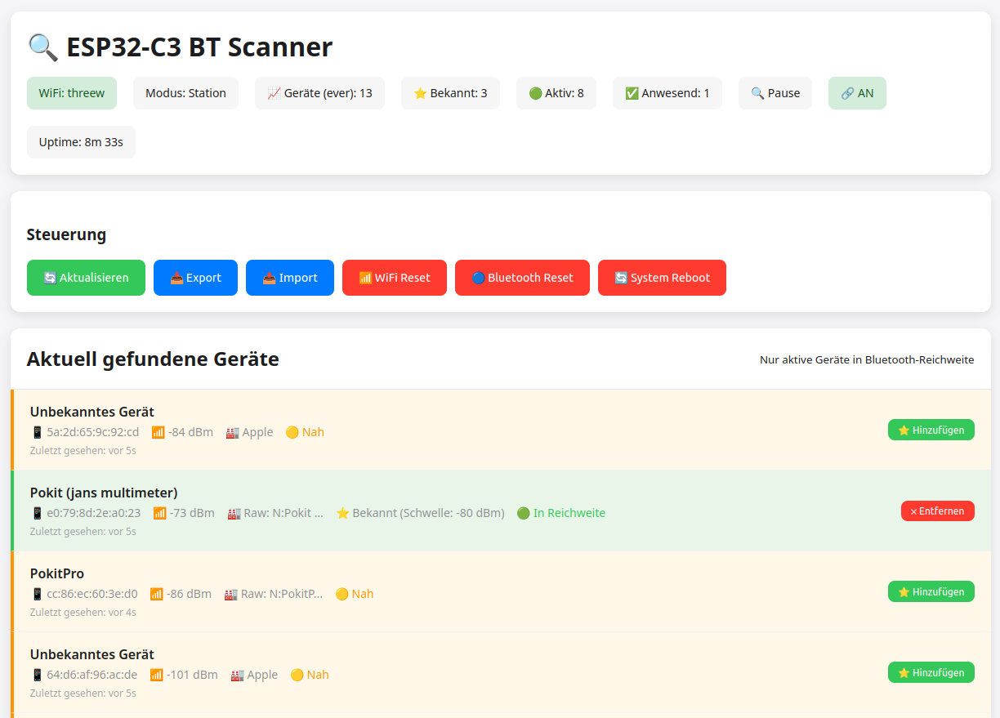
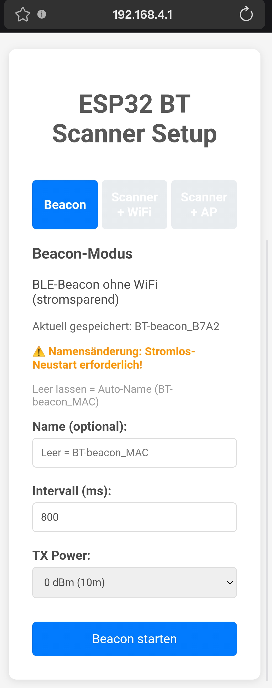
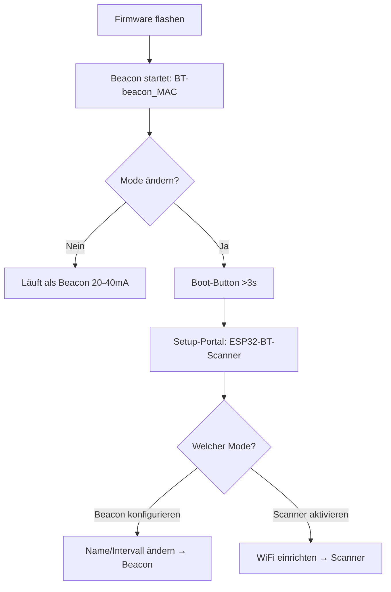

# ESP32-C3 Bluetooth Scanner & Home Automation Gateway

[](https://platformio.org/)
[](https://docs.espressif.com/projects/esp-idf/en/latest/esp32c3/)
[](https://opensource.org/licenses/MIT)
[](docs/performance.md)
[](docs/performance.md)

Kompaktes ESP32-C3 System zum Scannen von Bluetooth-Geräten mit Web-Oberfläche und einfachen HTTP-Integrationen (z.B. Loxone). Speicher-statisch, ohne serielle Laufzeit-Logs.

## 🎯 Hauptfunktionen

### 📡 Dual-Mode Operation
- **Beacon Mode (Default)**: Stromsparender BLE-Advertiser, ~20-40mA, kein WiFi
  - Bei Erstflash: Startet automatisch als `BT-beacon_<MAC>` (eindeutiger Name)
  - Wechsel zu Scanner: Boot-Button (GPIO9) >4s halten → Setup-Portal
- **Scanner Mode**: BLE-Geräte scannen, Web-Interface, Relais-Steuerung
  - Aktivierung nur via Setup-Portal nach Boot-Button >4s
  - WiFi erforderlich (Captive Portal oder Station Mode)
- **Mode-Switch**: Persistent in NVS gespeichert, überlebt Neustarts

### 🌐 Modernes Web-Interface (Scanner Mode)
- **Responsive Design**: Mobile-First Ansatz, Touch-optimiert
- **Aktualisierung**: On-Demand (Button/Seitenreload), kein Auto-Polling
- **Moderne Oberfläche**: Schlanke UI mit klarer Typografie
- **Dialog-Overlays**: Geräteverwaltung mit RSSI-Threshold-Einstellung
- **Payload-Hex-Dump**: Vollständige BLE-Advertising-Daten für Entwickler

### 📊 Geräteverwaltung
- **Aktive Geräte**: Bis zu 32 gleichzeitig gescannte BLE-Geräte (LRU-Ersetzung)
- **Bekannte Geräte**: Bis zu 200 persistente Geräte mit Kommentaren (32 Zeichen)
- **RSSI-Schwellenwerte**: Individuell pro Gerät einstellbar (-60 bis -90 dBm)
- **Timeout**: 2 Minuten ohne Signal = automatisch inaktiv
### 💾 Backup & Restore (Scanner Mode)
- **JSON-Export**: Download der bekannten Geräte
- **Import**: Browser-native File-API
- **Konfliktfrei**: Bestehende Geräte werden aktualisiert
- **Validierung**: Basis-JSON-Parsing ohne Schema-Validierung
- **Hardware WiFi-Reset**: Boot-Button (GPIO9) 3s drücken → WiFi-Credentials löschen

### 📡 Beacon Mode Features
- **Pure BLE Advertising**: Minimalistischer Advertiser ohne WiFi/Web-Interface
- **Power Optimized**: 20-40mA Stromverbrauch (mit USB-Serial), <15mA ohne USB
- **Light Sleep**: Explizites `esp_light_sleep_start()` zwischen Advertising-Zyklen
- **Duty-Cycle**: Advertising nur 100ms pro Intervall, Rest Sleep
- **LED Feedback**: Blinkt synchron mit Advertising (100ms)
- **Konfigurierbar**: Beacon-Name und Intervall über Web-Interface (im Scanner-Mode)
- **Persistent**: Einstellungen in NVS gespeichert, überleben Neustarts

### Relais-Modul Kompatibilität (Scanner Mode)
- **3.3V Logic-Level**: Direkt ESP32-C3 kompatibel
- **Optokoppler-Isolation**: Empfohlen für 24V-Industrie-Anwendungen
- **Max. Schaltleistung**: Abhängig vom verwendeten Relais-Modul
- **Anwendungen**: Türöffner, Garagentore, Beleuchtung, Schütze



## 🔧 Installation & Konfiguration

### Voraussetzungen
```bash
# PlatformIO Core Installation
pip install platformio

# Oder PlatformIO IDE für VS Code
# https://platformio.org/install/ide?install=vscode
```

### 0. Mode-Auswahl & Ersteinrichtung

**⚠️ WICHTIG: Bei frischem Flash startet das Gerät als Beacon!**

Das System unterstützt zwei Betriebsmodi:

**Beacon Mode (Werkseinstellung):**
- **Erststart**: Gerät advertised automatisch als `BT-beacon_<MAC-Suffix>`
  - Beispiel: `BT-beacon_193D` (letzte 4 Zeichen der MAC-Adresse)
  - Eindeutiger Name, kein manuelles Setup nötig
- **Stromverbrauch**: 20-40mA (mit USB), <15mA (ohne USB)
- **Keine Konfiguration nötig**: Läuft sofort nach Flash
- **LED**: Blinkt alle 700ms für 100ms (Standard-Intervall)

**Setup-Portal aufrufen (für alle Konfigurationen):**
```
Boot-Button (GPIO9) >4 Sekunden halten
→ LED blinkt schnell (20x, 100ms/100ms)
→ Setup-Portal startet als WiFi-AP "ESP32-BT-Scanner"
→ Automatisches Captive Portal öffnet sich
```


**Im Setup-Portal verfügbar:**
1. **Beacon-Konfiguration** (bleibt im Beacon-Mode):
   - Beacon-Name ändern (z.B. "Wohnzimmer-Beacon")
   - Advertising-Intervall: 500-2000ms
   - Speichern → Neustart als konfigurierter Beacon

2. **Scanner Mode aktivieren**:
   - WiFi-Zugangsdaten eingeben (Station Mode)
   - ODER als Access Point betreiben
   - Speichern → Neustart als Scanner mit vollem Feature-Set

**Scanner Mode:**
- **Aktivierung**: Nur über Setup-Portal (Boot-Button >3s)
- **Features**: BLE-Scan, Web-Interface, Relais-Steuerung, API
- **Stromverbrauch**: ~80-120mA (mit WiFi)
- **WiFi erforderlich**: Station oder AP Mode

**Zusammenfassung:**
```
Frisches Gerät → Beacon "BT-beacon_<MAC>"
Boot-Button >4s → Setup-Portal
  ├─ Beacon-Name ändern → Beacon mit neuem Namen
  └─ Scanner aktivieren → Scanner mit WiFi
```

### 1. Erstflash & Inbetriebnahme



**Schritt 1: Firmware flashen**
```bash
platformio run --target upload
```
→ **Gerät startet automatisch als Beacon** mit Name `BT-beacon_<MAC-Suffix>`
→ LED blinkt alle 700ms für 100ms
→ Kein Setup nötig, läuft sofort!

**Schritt 2: Mode/Konfiguration ändern (optional)**

Nur wenn Scanner-Mode gewünscht ODER Beacon-Name anpassen:

1. **Boot-Button (GPIO9) drücken & halten**:
   - Button mindestens 4 Sekunden halten
   - LED blinkt schnell (20x, 100ms/100ms) = Setup-Portal startet
   - Loslassen nach schnellem Blinken

2. **Setup-Portal verbindet automatisch**:
   - ESP32 startet Access Point: `ESP32-BT-Scanner` (OHNE Passwort)
   - Smartphone/Laptop verbinden
   - Captive Portal öffnet automatisch (oder manuell `http://192.168.4.1`)

3. **Im Setup-Portal**:
   
   **Option A - Beacon-Name ändern**:
   - Tab "Beacon" öffnen
   - Name eingeben (z.B. "Keller-Beacon")
   - Intervall anpassen (optional)
   - "Speichern" → Neustart als Beacon mit neuem Namen
   
   **Option B - Scanner aktivieren**:
   - Tab "WiFi" oder "Access Point" öffnen
   - WiFi-Credentials eingeben ODER AP-Mode wählen
   - "Speichern" → Neustart als Scanner
   - Web-Interface unter angezeigter IP verfügbar

**💡 Wichtig**:
- **Beacon-Mode**: Braucht KEIN Setup-Portal, läuft sofort nach Flash
- **Scanner-Mode**: Erfordert Boot-Button >4s + WiFi-Konfiguration
- **Setup-Portal**: Immer über Boot-Button >4s erreichbar (beide Modi)

### 2. Kompilierung & Upload

```bash
# Projekt klonen (falls noch nicht vorhanden)
git clone https://github.com/jandressler/esp32-bt-scanner.git
cd esp32-bt-scanner

# Dependencies automatisch installiert via platformio.ini
platformio run

# Upload auf ESP32-C3 (automatischer Port-Detection)
platformio run --target upload

# Serielle Konsole: Standard-Logs sind deaktiviert (Speicher-Optimierung)
platformio device monitor --baud 115200
```

### 3. Erste Einrichtung & Konfiguration

**Scanner Mode Setup:**


1. **Web-Interface**: `http://[ESP32_IP]` öffnen (solange kein WLAN verbunden ist erscheint automatisch die Setup-Seite, danach die Hauptseite)
2. **Geräte-Scan**: Läuft automatisch, BLE-Geräte erscheinen in Liste
3. **Bekannte Geräte**: Gewünschte Geräte als "bekannt" markieren
4. **RSSI-Tuning**: Schwellenwerte pro Gerät einstellen (-60 bis -90 dBm)
5. **Backup**: Export erstellen für Datensicherung
6. **Produktiv**: System läuft 24/7 mit automatischem Monitoring

**Beacon Mode Setup (ab Werk):**
1. **Erstflash**: Gerät läuft automatisch als Beacon
2. **Standard-Name**: `BT-beacon_<MAC>` (eindeutig, z.B. "BT-beacon_193D")
3. **Standard-Intervall**: 800ms
4. **Name ändern**: Boot-Button >4s → Setup-Portal → Beacon-Tab → Name + Intervall
5. **Betrieb**: LED blinkt synchron mit Advertising (100ms aktiv, Rest Sleep)
6. **Zu Scanner wechseln**: Boot-Button >4s → Setup-Portal → Scanner aktivieren

## 🌐 Web-Interface Features

### Dashboard-Übersicht
```
┌─ Status-Bar ─────────────────────────────────────────┐
│ WiFi: ✅ Connected │ Geräte: 5/32 │ Output: 🟢 AN     │
│ Uptime: 2d 14h 32m │ Scan: ✅ Active │ RAM: 21.5%    │
└──────────────────────────────────────────────────────┘

┌─ Bekannte Geräte ──────────────────────────────────────┐
│ 📱 iPhone 15 Pro        │ 🟢 Anwesend │ -65 dBm      │
│ 🎧 AirPods Pro          │ 🔴 Abwesend │ ---          │
│ ⌚ Apple Watch Ultra     │ 🟡 Schwach  │ -89 dBm      │
└────────────────────────────────────────────────────────┘

┌─ Output-Log (letzte 30 Einträge) ──────────────────────┐
│ gerade eben │ iPhone 15 Pro │ 🟢 AN  │ Gerät erkannt │
│ vor 2m      │ AirPods Pro   │ 🔴 AUS │ Signal zu schwach
│ vor 5m      │ System        │ 🟢 AN  │ Test-Schaltung│
└────────────────────────────────────────────────────────┘
```

### Erweiterte Funktionen
- **Payload-Analyse**: Hex-Dump mit Hersteller-Dekodierung
- **Filter & Sortierung**: Nach Name, RSSI, Hersteller, Status
- **Export/Import**: JSON-basierte Backup-/Restore-Funktionen
- **System-Management**: WiFi/Bluetooth/System Reset-Buttons
- **Aktualisierung**: On-Demand via Button oder Seitenreload

## 🔗 REST-API Dokumentation

### 📱 Device Management API

```http
GET  /api/devices
Content-Type: application/json

Response:
{
  "status": "success",
  "devices": [
    {
      "address": "aa:bb:cc:dd:ee:ff",
      "name": "iPhone 15 Pro",
      "rssi": -65,
      "known": true,
      "active": true,
      "lastSeenRelative": "vor 5s",
      "manufacturer": "Apple Inc.",
      "payloadHex": "0201061AFF...",
      "comment": "Mein iPhone",
      "rssiThreshold": -70,
      "proximityStatus": "green"
    }
  ],
  "knownDevices": [
    {
      "address": "aa:bb:cc:dd:ee:ff",
      "comment": "Mein iPhone",
      "rssiThreshold": -70,
      "present": true,
      "proximityStatus": "green"
    }
  ]
}
```

```http
POST /api/device/known?address={MAC}&known={true|false}&comment={TEXT}&rssiThreshold={-60..-90}
Content-Type: application/json

Response:
{
  "status": "success",
  "message": "Gerät als bekannt markiert"
}
```

### 📊 System Status API

```http
GET /api/status
Response:
{
  "uptime": "2h 15m",
  "devices_ever": 42,
  "devices": 5,
  "known": 3,
  "present": 2,
  "wifi_connected": true,
  "wifi_ssid": "HomeNetwork",
  "wifi_rssi": -45,
  "wifi_ip": "192.168.1.100",
  "wifi_gateway": "192.168.1.1",
  "wifi_subnet": "255.255.255.0",
  "wifi_dns": "192.168.1.1",
  "wifi_mode": "Station",
  "heap_free": 228456,
  "scanning": true,
  "outputActive": true
}
```

### 📝 Output Log API

```http
GET  /api/output-log
Content-Type: application/json

Response:
{
  "outputLog": [
    {
      "timestamp": 1696518234,
      "deviceAddress": "aa:bb:cc:dd:ee:ff",
      "deviceName": "iPhone 15 Pro",
      "comment": "Mein iPhone",
      "outputState": true,
      "reason": "Gerät erkannt",
      "formattedTime": "gerade eben"
    }
  ]
}
```

```http
POST /api/output-log/clear    # Log löschen
POST /api/output-log/test     # Test-Eintrag erstellen
```

### 💾 Backup & Restore API

```http
GET  /api/export-devices-file
Content-Type: application/json
Content-Disposition: attachment; filename="bt_scanner_backup_2024-10-05-14-30-15.json"

Response:
{
  "devices": [
    {
      "address": "aa:bb:cc:dd:ee:ff",
      "name": "iPhone 15 Pro",
      "comment": "Mein iPhone",
      "rssiThreshold": -70,
      "isKnown": true
    }
  ],
  "backup_info": {
    "version": "1.0",
    "device_count": 1,
    "export_time": 1696518234,
    "description": "BT Scanner Backup - Bekannte Geräte"
  }
}
```

```http
POST /api/import-devices
Content-Type: application/json
Body: {JSON backup data}

Response:
{
  "status": "success",
  "message": "3 Geräte erfolgreich importiert"
}
```

### 🔧 System Management API

```http
POST /api/system/reboot       # ESP32 Neustart (ohne Änderungen)
POST /api/factory-reset       # WiFi-Credentials löschen + Neustart (Gerät geht offline!)
POST /api/bluetooth/reset     # Bluetooth-Stack neustart
GET  /health                  # Health check für Monitoring (Response: "ok")
```

### 🔌 Setup & Netzwerk API

```http
GET  /api/scan
Content-Type: application/json

# Netzwerk-Scan für WiFi-Setup
Response:
{
  "status": "success",
  "networks": [
    {
      "ssid": "HomeNetwork",
      "rssi": -45,
      "auth": true
    }
  ]
}
```

```http
POST /setup/wifi
Content-Type: application/json

# WiFi-Konfiguration (intern vom Setup-Portal verwendet)
Body:
{
  "ssid": "HomeNetwork",
  "password": "secret",
  "scanner": true,
  "static_ip": "192.168.1.100",  # optional
  "gateway": "192.168.1.1",       # optional
  "subnet": "255.255.255.0",      # optional
  "dns": "8.8.8.8"                # optional
}
```

```http
POST /setup/ap
Content-Type: application/json

# Access Point Passwort setzen (intern vom Setup-Portal verwendet)
Body:
{
  "password": "min8chars"
}
```

## 🏠 Loxone Home Automation Integration

### Miniserver HTTP-Eingänge

```http
GET /loxone/presence
Content-Type: text/plain
Response: "present" | "absent"

GET /loxone/status  
Content-Type: text/plain
Response: "online" | "error"

GET /loxone/device?address={MAC}
Content-Type: text/plain
Response: "present" | "absent" | "unknown"
```

### Loxone Konfiguration

**1. Virtueller HTTP-Eingang erstellen:**
```
Name: BT_Scanner_Presence
URI: http://192.168.1.100/loxone/presence
Abfrageintervall: 10 Sekunden
Timeout: 5 Sekunden
Parser: Text-Parser
Erwartete Werte: "present", "absent"
```

**2. Funktionsblock-Programmierung:**
```
┌─ HTTP-Eingang ─┐    ┌─ Text-Vergleich ─┐    ┌─ Aktion ─┐
│ BT_Scanner     │───▶│ = "present"      │───▶│ Licht AN │
│ _Presence      │    │                  │    └──────────┘
└────────────────┘    └──────────────────┘
                              │
                              ▼
                      ┌─ Sonst-Aktion ─┐
                      │ Sicherheitsmodus│
                      └─────────────────┘
```

**3. Erweiterte Anwendungen:**
```bash
# System-Überwachung
curl http://192.168.1.100/loxone/status
# Bei "error" → Benachrichtigung senden

# Personenspezifische Automation
curl "http://192.168.1.100/loxone/device?address=aa:bb:cc:dd:ee:ff"
# Individuelle Beleuchtungs-/Heizungssteuerung

# Anwesenheitserkennung
curl http://192.168.1.100/loxone/presence
# Haupt-Anwesenheitsstatus für Gebäude-Automation
```

## ⚡ Hardware-Ausgänge

### LED-Status (GPIO 8)
- **Onboard RGB-LED** zeigt Anwesenheitsstatus
- **AN** (leuchtet): Mindestens 1 bekanntes Gerät in Reichweite
- **AUS**: Kein bekanntes Gerät erkannt
- Invertierte Logik: LOW = AN, HIGH = AUS

### Relais-Ausgang (GPIO 4)
- **3.3V Logic-Level** für Relais-Module
- **HIGH**: Mindestens 1 bekanntes Gerät erkannt
- **LOW**: Kein bekanntes Gerät in Reichweite
- Synchron mit LED geschaltet

### Anwesenheitserkennung
Prüft alle 10 Sekunden (nach jedem BLE-Scan):
1. Durchsucht alle bekannten Geräte
2. Vergleicht RSSI mit individuellem Schwellenwert
3. Bei Treffer: LED + Relais AN, Log-Eintrag
4. Kein Treffer: LED + Relais AUS

## 🏭 24V Industrie-Integration (optional)

### Professionelle 24V-Setup-Architektur

```
┌─ 24V DC Versorgung ─┐     ┌─ ESP32-C3 System ─┐     ┌─ 24V Load ─┐
│ Netzteil/Hutschiene │────▶│ DC-DC Wandler      │     │ Türöffner  │
│ 24V/2A             │     │ 24V→3.3V/1A        │     │ Schütz     │
└────────────────────┘     │ Galv. getrennt     │     │ Ventil     │
                          └────────────────────┘     │ Motor      │
                                    │                └────────────┘
                          ┌─ GPIO 4 (3.3V) ─┐             ▲
                          │                 │             │
                          ▼                 ▼             │
                   ┌─ Optokoppler ─┐ ┌─ Relais-Board ─┐   │
                   │ PC817         │ │ 24V/10A        │───┘
                   │ 3.3V → 24V    │ │ Solid State    │
                   └───────────────┘ └────────────────┘
```

### Vorteile der 24V-Integration
- ✅ **Galvanische Trennung**: ESP32-C3 Schutz vor Industriespannungen
- ✅ **EMV-Konformität**: Optokoppler filtert elektromagnetische Störungen
- ✅ **Hohe Schaltlasten**: 24V Relais für Motoren, Schütze (bis 10A)
- ✅ **Fernverkabelung**: 24V über große Distanzen ohne Spannungsabfall
- ✅ **Industriestandard**: Kompatibel mit SPS, Schaltschränken, Hutschienen

### Komponenten-Empfehlungen
```yaml
DC-DC Wandler: TRACO TEN 3-2411WI (24V→3.3V, 1A, 1.5kV isolation)
Optokoppler: PC817 (CTR >50%, 35V, 50mA)
Relais-Modul: Crydom D24xx (24V Solid State, 3-32V control)
Verkabelung: 0.75mm² für Steuerleitungen, 1.5mm² für Lastkreise
Sicherung: Automaten-Sicherung B2A für 24V-Kreis
```

## 📊 Performance & Ressourcen-Monitoring

### Aktuelle System-Auslastung
```yaml
RAM-Nutzung:
  Gesamt: 320KB
  Verwendet: 89.236 bytes (27.2%)
  Verfügbar: 238.444 bytes (72.8%)
  Stack: ~8KB (reserviert)
  Heap: ~260KB (dynamisch)

Flash-Nutzung:
  Gesamt: 4MB
  Firmware: 1.495.176 bytes (47.5%)
  Verfügbar: 1.650.552 bytes (52.5%)
  OTA-Reserve: ~1.5MB (für Updates)
  Filesystem: ~500KB (für zukünftige Features)

CPU-Performance:
  Architektur: RISC-V 160MHz
  BLE-Scan: ~2% CPU (2s alle 10s)
  Web-Server: ~1% CPU (idle)
  JSON-Processing: ~5% CPU (bei API-Calls)
  Watchdog: <0.1% CPU (Hardware-Timer)
```

### Timing-Charakteristiken

**Scanner Mode:**
```yaml
Scan-Zyklus: 10s (2s scan + 8s pause)
API-Response: <50ms (typ. 20-30ms)
Web-Page-Load: <200ms (kompressed HTML)
Relais-Switching: <1ms (GPIO direct)
System-Startup: <5s (WiFi + BLE init)
Recovery-Time: ~3s (nach Watchdog-Reset)
```

**Beacon Mode:**
```yaml
Advertising-Zyklus: Konfigurierbar (100-10000ms, Standard 800ms)
Active-Time: 100ms (Advertising + LED)
Sleep-Time: (Intervall - 100ms)
Light-Sleep-Entry: <5ms
Light-Sleep-Wakeup: <5ms
System-Startup: <2s (1s LED-Blink, dann BLE init)
Power-Consumption: 20-40mA (mit USB), <15mA (ohne USB)
```

### Speicher-Management

**Scanner Mode:**
```cpp
// Device Arrays (statisch alloziert)
SafeDevice devices[MAX_DEVICES];              // 32 * 280 bytes = 8.9KB
char knownMACs[MAX_KNOWN][18];               // 200 * 18 bytes = 3.6KB
char knownComments[MAX_KNOWN][MAX_COMMENT_LENGTH]; // 200 * 32 bytes = 6.4KB
int knownRSSIThresholds[MAX_KNOWN];          // 200 * 4 bytes = 0.8KB
OutputLogEntry outputLog[MAX_OUTPUT_LOG_ENTRIES]; // 30 * 120 bytes = 3.6KB

// Total Static Memory: ~23KB
// Dynamic Memory (JSON, Buffers): ~15KB
// Network Buffers: ~20KB
// Bluetooth Stack: ~25KB
```

**Beacon Mode:**
```cpp
// Minimal Memory Footprint
BLEAdvertising* advertising;                  // ~200 bytes
BeaconConfig config (NVS);                    // ~50 bytes
Bluetooth Stack (BLE only):                   // ~15KB

// Total Memory: ~16KB (vs ~83KB Scanner Mode)
// RAM Savings: ~67KB freed (no WiFi, no Web-Server, no Device-Arrays)
```

## 🔍 Troubleshooting & Debug

### Häufige Probleme

**WiFi verbindet nicht**
- Boot-Button 4s halten → Setup-Portal öffnen
- 2.4GHz WLAN verwenden (5GHz nicht unterstützt)
- Näher am Router platzieren (< 5m für Setup)

**Beacon nicht sichtbar**
- BLE-Scanner-App nutzen (nRF Connect, LightBlue)
- Beacon-Name: "BT-beacon_<MAC>"
- Längeres Intervall = seltener sichtbar (normal bei >1000ms)

**Keine BLE-Geräte gefunden**
- Web-Interface: "Bluetooth Reset" Button
- Smartphone: Bluetooth aus/ein
- RSSI-Schwellenwert anpassen (-60 → -80)

**Gerät wird nicht erkannt**
- RSSI-Threshold prüfen (Standard: -80)
- Gerät näher bewegen (< 5m)
- Output-Log auf Statuswechsel prüfen
- 2min Timeout bis Gerät als "weg" gilt

**Stromverbrauch**
- Beacon: 20-40mA (mit USB), <15mA (ohne USB)
- Scanner: 70-100mA (WiFi + BLE aktiv)
- USB-Chip: +15-30mA Overhead

### Hardware-Diagnose
```bash
# LED-Status interpretieren

Beacon Mode:
1 langes Blinken (1s): Beacon-Start erfolgreich
Kurzer Blink (100ms):  Advertising-Zyklus aktiv (alle X ms, Standard 800ms)

Boot-Button Sequenz:
Button >4s halten:     Nach 4s schnelles Blinken (20x, 100ms/100ms)
                       Setup-Portal startet danach

Setup Mode:
Sehr schnelles Blinken: Setup-Portal aktiv (100ms/100ms)
                        WiFi-AP "ESP32-BT-Scanner" verfügbar

Scanner Mode:
Dauerhaft AN:          Mindestens ein bekanntes Gerät in Reichweite (Threshold erfüllt)
Dauerhaft AUS:         Kein bekanntes Gerät in Reichweite

# GPIO-Testing via API
curl -X POST http://IP/api/output-log/test
# Erwartung: LED blinkt 5x, Relais klickt

# Relais-Diagnose
1. Verkabelung prüfen: GPIO 4 → Relais IN
2. Spannung messen: 3.3V bei present=true
3. Relais-Spezifikation: 3.3V Trigger-Level
4. Last-Strom prüfen: <10mA für GPIO
```

### Performance-Monitoring
```bash
# RAM-Monitoring via API
curl http://IP/api/status | jq '.system.freeHeap'
# Normal: >200KB verfügbar

# Uptime-Tracking
curl http://IP/api/status | jq '.system.uptime'
# Target: >7 Tage ohne Reset

# Scan-Performance
# Normal: Device-Liste alle 10s aktualisiert
# Problem: Keine Updates >30s = BLE-Fehler
```