# ESP32-C3 Bluetooth Scanner & Home Automation Gateway

[](https://platformio.org/)
[](https://docs.espressif.com/projects/esp-idf/en/latest/esp32c3/)
[](https://opensource.org/licenses/MIT)
[](docs/performance.md)
[](docs/performance.md)

Kompaktes ESP32-C3 System zum Scannen von Bluetooth-Geräten mit Web-Oberfläche und einfachen HTTP-Integrationen (z.B. Loxone). Speicher-statisch, ohne serielle Laufzeit-Logs.

## 🎯 Hauptfunktionen

### 📡 Dual-Mode Operation
- **Beacon Mode (Default)**: Stromsparender BLE-Advertiser, ~20-40mA, kein WiFi
  - Bei Erstflash: Startet automatisch als `BT-beacon_<MAC>` (eindeutiger Name)
  - Wechsel zu Scanner: Boot-Button (GPIO9) >4s halten → Setup-Portal
- **Scanner Mode**: BLE-Geräte scannen, Web-Interface, Relais-Steuerung
  - Aktivierung nur via Setup-Portal nach Boot-Button >4s
  - WiFi erforderlich (Captive Portal oder Station Mode)
- **Mode-Switch**: Persistent in NVS gespeichert, überlebt Neustarts

### 🌐 Modernes Web-Interface (Scanner Mode)
- **Responsive Design**: Mobile-First Ansatz, Touch-optimiert
- **Aktualisierung**: On-Demand (Button/Seitenreload), kein Auto-Polling
- **Moderne Oberfläche**: Schlanke UI mit klarer Typografie
- **Dialog-Overlays**: Geräteverwaltung mit RSSI-Threshold-Einstellung
- **Payload-Hex-Dump**: Vollständige BLE-Advertising-Daten für Entwickler

### 📊 Geräteverwaltung
- **Aktive Geräte**: Bis zu 32 gleichzeitig gescannte BLE-Geräte (LRU-Ersetzung)
- **Bekannte Geräte**: Bis zu 200 persistente Geräte mit Kommentaren (32 Zeichen)
- **RSSI-Schwellenwerte**: Individuell pro Gerät einstellbar (-60 bis -90 dBm)
- **Timeout**: 2 Minuten ohne Signal = automatisch inaktiv
### 💾 Backup & Restore (Scanner Mode)
- **JSON-Export**: Download der bekannten Geräte
- **Import**: Browser-native File-API
- **Konfliktfrei**: Bestehende Geräte werden aktualisiert
- **Validierung**: Basis-JSON-Parsing ohne Schema-Validierung
- **Hardware WiFi-Reset**: Boot-Button (GPIO9) 3s drücken → WiFi-Credentials löschen

### 📡 Beacon Mode Features
- **Pure BLE Advertising**: Minimalistischer Advertiser ohne WiFi/Web-Interface
- **Power Optimized**: 20-40mA Stromverbrauch (mit USB-Serial), <15mA ohne USB
- **Light Sleep**: Explizites `esp_light_sleep_start()` zwischen Advertising-Zyklen
- **Duty-Cycle**: Advertising nur 100ms pro Intervall, Rest Sleep
- **LED Feedback**: Blinkt synchron mit Advertising (100ms)
- **Konfigurierbar**: Beacon-Name und Intervall über Web-Interface (im Scanner-Mode)
- **Persistent**: Einstellungen in NVS gespeichert, überleben Neustarts

### Relais-Modul Kompatibilität (Scanner Mode)
- **3.3V Logic-Level**: Direkt ESP32-C3 kompatibel
- **Optokoppler-Isolation**: Empfohlen für 24V-Industrie-Anwendungen
- **Max. Schaltleistung**: Abhängig vom verwendeten Relais-Modul
- **Anwendungen**: Türöffner, Garagentore, Beleuchtung, Schütze

## 🔧 Installation & Konfiguration

### Voraussetzungen
```bash
# PlatformIO Core Installation
pip install platformio

# Oder PlatformIO IDE für VS Code
# https://platformio.org/install/ide?install=vscode
```

### 0. Mode-Auswahl & Ersteinrichtung

**⚠️ WICHTIG: Bei frischem Flash startet das Gerät als Beacon!**

Das System unterstützt zwei Betriebsmodi:

**Beacon Mode (Werkseinstellung):**
- **Erststart**: Gerät advertised automatisch als `BT-beacon_<MAC-Suffix>`
  - Beispiel: `BT-beacon_193D` (letzte 4 Zeichen der MAC-Adresse)
  - Eindeutiger Name, kein manuelles Setup nötig
- **Stromverbrauch**: 20-40mA (mit USB), <15mA (ohne USB)
- **Keine Konfiguration nötig**: Läuft sofort nach Flash
- **LED**: Blinkt alle 700ms für 100ms (Standard-Intervall)

**Setup-Portal aufrufen (für alle Konfigurationen):**
```
Boot-Button (GPIO9) >4 Sekunden halten
→ LED blinkt schnell (20x, 100ms/100ms)
→ Setup-Portal startet als WiFi-AP "ESP32-BT-Scanner"
→ Automatisches Captive Portal öffnet sich
```

**Im Setup-Portal verfügbar:**
1. **Beacon-Konfiguration** (bleibt im Beacon-Mode):
   - Beacon-Name ändern (z.B. "Wohnzimmer-Beacon")
   - Advertising-Intervall: 500-2000ms
   - Speichern → Neustart als konfigurierter Beacon

2. **Scanner Mode aktivieren**:
   - WiFi-Zugangsdaten eingeben (Station Mode)
   - ODER als Access Point betreiben
   - Speichern → Neustart als Scanner mit vollem Feature-Set

**Scanner Mode:**
- **Aktivierung**: Nur über Setup-Portal (Boot-Button >3s)
- **Features**: BLE-Scan, Web-Interface, Relais-Steuerung, API
- **Stromverbrauch**: ~80-120mA (mit WiFi)
- **WiFi erforderlich**: Station oder AP Mode

**Zusammenfassung:**
```
Frisches Gerät → Beacon "BT-beacon_<MAC>"
Boot-Button >4s → Setup-Portal
  ├─ Beacon-Name ändern → Beacon mit neuem Namen
  └─ Scanner aktivieren → Scanner mit WiFi
```

### 1. Erstflash & Inbetriebnahme

```mermaid
graph TD
    A[Firmware flashen] --> B[Beacon startet: BT-beacon_MAC]
    B --> C{Mode ändern?}
    C -->|Nein| D[Läuft als Beacon 20-40mA]
    C -->|Ja| E[Boot-Button >3s]
    E --> F[Setup-Portal: ESP32-BT-Scanner]
    F --> G{Welcher Mode?}
    G -->|Beacon konfigurieren| H[Name/Intervall ändern → Beacon]
    G -->|Scanner aktivieren| I[WiFi einrichten → Scanner]
```



**Schritt 1: Firmware flashen**
```bash
platformio run --target upload
```
→ **Gerät startet automatisch als Beacon** mit Name `BT-beacon_<MAC-Suffix>`
→ LED blinkt alle 700ms für 100ms
→ Kein Setup nötig, läuft sofort!

**Schritt 2: Mode/Konfiguration ändern (optional)**

Nur wenn Scanner-Mode gewünscht ODER Beacon-Name anpassen:

1. **Boot-Button (GPIO9) drücken & halten**:
   - Button mindestens 4 Sekunden halten
   - LED blinkt schnell (20x, 100ms/100ms) = Setup-Portal startet
   - Loslassen nach schnellem Blinken

2. **Setup-Portal verbindet automatisch**:
   - ESP32 startet Access Point: `ESP32-BT-Scanner` (OHNE Passwort)
   - Smartphone/Laptop verbinden
   - Captive Portal öffnet automatisch (oder manuell `http://192.168.4.1`)

3. **Im Setup-Portal**:
   
   **Option A - Beacon-Name ändern**:
   - Tab "Beacon" öffnen
   - Name eingeben (z.B. "Keller-Beacon")
   - Intervall anpassen (optional)
   - "Speichern" → Neustart als Beacon mit neuem Namen
   
   **Option B - Scanner aktivieren**:
   - Tab "WiFi" oder "Access Point" öffnen
   - WiFi-Credentials eingeben ODER AP-Mode wählen
   - "Speichern" → Neustart als Scanner
   - Web-Interface unter angezeigter IP verfügbar

**💡 Wichtig**:
- **Beacon-Mode**: Braucht KEIN Setup-Portal, läuft sofort nach Flash
- **Scanner-Mode**: Erfordert Boot-Button >4s + WiFi-Konfiguration
- **Setup-Portal**: Immer über Boot-Button >4s erreichbar (beide Modi)

### 2. Kompilierung & Upload

```bash
# Projekt klonen (falls noch nicht vorhanden)
git clone https://github.com/jandressler/esp32-bt-scanner.git
cd esp32-bt-scanner

# Dependencies automatisch installiert via platformio.ini
platformio run

# Upload auf ESP32-C3 (automatischer Port-Detection)
platformio run --target upload

# Serielle Konsole: Standard-Logs sind deaktiviert (Speicher-Optimierung)
platformio device monitor --baud 115200
```

### 3. Erste Einrichtung & Konfiguration

**Scanner Mode Setup:**


1. **Web-Interface**: `http://[ESP32_IP]` öffnen (solange kein WLAN verbunden ist erscheint automatisch die Setup-Seite, danach die Hauptseite)
2. **Geräte-Scan**: Läuft automatisch, BLE-Geräte erscheinen in Liste
3. **Bekannte Geräte**: Gewünschte Geräte als "bekannt" markieren
4. **RSSI-Tuning**: Schwellenwerte pro Gerät einstellen (-60 bis -90 dBm)
5. **Backup**: Export erstellen für Datensicherung
6. **Produktiv**: System läuft 24/7 mit automatischem Monitoring

**Beacon Mode Setup (ab Werk):**
1. **Erstflash**: Gerät läuft automatisch als Beacon
2. **Standard-Name**: `BT-beacon_<MAC>` (eindeutig, z.B. "BT-beacon_193D")
3. **Standard-Intervall**: 800ms
4. **Name ändern**: Boot-Button >4s → Setup-Portal → Beacon-Tab → Name + Intervall
5. **Betrieb**: LED blinkt synchron mit Advertising (100ms aktiv, Rest Sleep)
6. **Zu Scanner wechseln**: Boot-Button >4s → Setup-Portal → Scanner aktivieren

## 🌐 Web-Interface Features

### Dashboard-Übersicht
```
┌─ Status-Bar ─────────────────────────────────────────┐
│ WiFi: ✅ Connected │ Geräte: 5/32 │ Output: 🟢 AN     │
│ Uptime: 2d 14h 32m │ Scan: ✅ Active │ RAM: 21.5%    │
└──────────────────────────────────────────────────────┘

┌─ Bekannte Geräte ──────────────────────────────────────┐
│ 📱 iPhone 15 Pro        │ 🟢 Anwesend │ -65 dBm      │
│ 🎧 AirPods Pro          │ 🔴 Abwesend │ ---          │
│ ⌚ Apple Watch Ultra     │ 🟡 Schwach  │ -89 dBm      │
└────────────────────────────────────────────────────────┘

┌─ Output-Log (letzte 30 Einträge) ──────────────────────┐
│ gerade eben │ iPhone 15 Pro │ 🟢 AN  │ Gerät erkannt │
│ vor 2m      │ AirPods Pro   │ 🔴 AUS │ Signal zu schwach
│ vor 5m      │ System        │ 🟢 AN  │ Test-Schaltung│
└────────────────────────────────────────────────────────┘
```

### Erweiterte Funktionen
- **Payload-Analyse**: Hex-Dump mit Hersteller-Dekodierung
- **Filter & Sortierung**: Nach Name, RSSI, Hersteller, Status
- **Export/Import**: JSON-basierte Backup-/Restore-Funktionen
- **System-Management**: WiFi/Bluetooth/System Reset-Buttons
- **Aktualisierung**: On-Demand via Button oder Seitenreload

## 🔗 REST-API Dokumentation

### 📱 Device Management API

```http
GET  /api/devices
Content-Type: application/json

Response:
{
  "status": "success",
  "devices": [
    {
      "address": "aa:bb:cc:dd:ee:ff",
      "name": "iPhone 15 Pro",
      "rssi": -65,
      "known": true,
      "active": true,
      "lastSeenRelative": "vor 5s",
      "manufacturer": "Apple Inc.",
      "payloadHex": "0201061AFF...",
      "comment": "Mein iPhone",
      "rssiThreshold": -70,
      "proximityStatus": "green"
    }
  ],
  "knownDevices": [
    {
      "address": "aa:bb:cc:dd:ee:ff",
      "comment": "Mein iPhone",
      "rssiThreshold": -70,
      "present": true,
      "proximityStatus": "green"
    }
  ]
}
```

```http
POST /api/device/known?address={MAC}&known={true|false}&comment={TEXT}&rssiThreshold={-60..-90}
Content-Type: application/json

Response:
{
  "status": "success",
  "message": "Gerät als bekannt markiert"
}
```

### 📊 System Status API

```http
GET /api/status
Response:
{
  "uptime": "2h 15m",
  "devices_ever": 42,
  "devices": 5,
  "known": 3,
  "present": 2,
  "wifi_connected": true,
  "wifi_ssid": "HomeNetwork",
  "wifi_rssi": -45,
  "wifi_ip": "192.168.1.100",
  "wifi_gateway": "192.168.1.1",
  "wifi_subnet": "255.255.255.0",
  "wifi_dns": "192.168.1.1",
  "wifi_mode": "Station",
  "heap_free": 228456,
  "scanning": true,
  "outputActive": true
}
```

### 📝 Output Log API

```http
GET  /api/output-log
Content-Type: application/json

Response:
{
  "outputLog": [
    {
      "timestamp": 1696518234,
      "deviceAddress": "aa:bb:cc:dd:ee:ff",
      "deviceName": "iPhone 15 Pro",
      "comment": "Mein iPhone",
      "outputState": true,
      "reason": "Gerät erkannt",
      "formattedTime": "gerade eben"
    }
  ]
}
```

```http
POST /api/output-log/clear    # Log löschen
POST /api/output-log/test     # Test-Eintrag erstellen
```

### 💾 Backup & Restore API

```http
GET  /api/export-devices-file
Content-Type: application/json
Content-Disposition: attachment; filename="bt_scanner_backup_2024-10-05-14-30-15.json"

Response:
{
  "devices": [
    {
      "address": "aa:bb:cc:dd:ee:ff",
      "name": "iPhone 15 Pro",
      "comment": "Mein iPhone",
      "rssiThreshold": -70,
      "isKnown": true
    }
  ],
  "backup_info": {
    "version": "1.0",
    "device_count": 1,
    "export_time": 1696518234,
    "description": "BT Scanner Backup - Bekannte Geräte"
  }
}
```

```http
POST /api/import-devices-file
Content-Type: application/json
Body: {JSON backup data}

Response:
{
  "status": "success",
  "message": "3 Geräte erfolgreich importiert"
}
```

### 🔧 System Management API

```http
POST /api/system/reset         # ESP32 Neustart
POST /api/wifi/reset          # WiFi-Credentials löschen
POST /api/bluetooth/reset     # Bluetooth-Stack neustart
```

## 🏠 Loxone Home Automation Integration

### Miniserver HTTP-Eingänge

```http
GET /loxone/presence
Content-Type: text/plain
Response: "present" | "absent"

GET /loxone/status  
Content-Type: text/plain
Response: "online" | "error"

GET /loxone/device?address={MAC}
Content-Type: text/plain
Response: "present" | "absent" | "unknown"
```

### Loxone Konfiguration

**1. Virtueller HTTP-Eingang erstellen:**
```
Name: BT_Scanner_Presence
URI: http://192.168.1.100/loxone/presence
Abfrageintervall: 10 Sekunden
Timeout: 5 Sekunden
Parser: Text-Parser
Erwartete Werte: "present", "absent"
```

**2. Funktionsblock-Programmierung:**
```
┌─ HTTP-Eingang ─┐    ┌─ Text-Vergleich ─┐    ┌─ Aktion ─┐
│ BT_Scanner     │───▶│ = "present"      │───▶│ Licht AN │
│ _Presence      │    │                  │    └──────────┘
└────────────────┘    └──────────────────┘
                              │
                              ▼
                      ┌─ Sonst-Aktion ─┐
                      │ Sicherheitsmodus│
                      └─────────────────┘
```

**3. Erweiterte Anwendungen:**
```bash
# System-Überwachung
curl http://192.168.1.100/loxone/status
# Bei "error" → Benachrichtigung senden

# Personenspezifische Automation
curl "http://192.168.1.100/loxone/device?address=aa:bb:cc:dd:ee:ff"
# Individuelle Beleuchtungs-/Heizungssteuerung

# Anwesenheitserkennung
curl http://192.168.1.100/loxone/presence
# Haupt-Anwesenheitsstatus für Gebäude-Automation
```

## ⚡ Hardware-Integration Details

### LED-Steuerung (GPIO 8)
```cpp
// ESP32-C3 onboard RGB LED - Invertierte Logik
#define LED_BUILTIN_PIN 8

// LED-Status-Mapping
digitalWrite(LED_BUILTIN_PIN, LOW);   // LED AN  (present = true)
digitalWrite(LED_BUILTIN_PIN, HIGH);  // LED AUS (present = false)

// Blink-Pattern für Feedback
void blinkLED(int times, int delayMs) {
    for(int i = 0; i < times; i++) {
        digitalWrite(LED_BUILTIN_PIN, LOW);   // AN
        delay(delayMs);
        digitalWrite(LED_BUILTIN_PIN, HIGH);  // AUS
        delay(delayMs);
    }
}
```

### Relais-Steuerung (GPIO 4)
```cpp
// Standard Logic-Level Relais
#define RELAY_OUTPUT_PIN 4

// Relais-Steuerung
digitalWrite(RELAY_OUTPUT_PIN, HIGH);  // Relais AN  (present = true)
digitalWrite(RELAY_OUTPUT_PIN, LOW);   // Relais AUS (present = false)

// Synchrone LED+Relais Steuerung
void setPresenceOutput(bool devicePresent) {
    digitalWrite(LED_BUILTIN_PIN, devicePresent ? LOW : HIGH);    // LED
    digitalWrite(RELAY_OUTPUT_PIN, devicePresent ? HIGH : LOW);   // Relais
    
    // Log-Eintrag bei Statuswechsel
    if (devicePresent != lastOutputState) {
        deviceManager.logOutputChange(
            triggerDevice, triggerName, triggerComment, 
            devicePresent, 
            devicePresent ? "Gerät erkannt" : "Kein bekanntes Gerät in Reichweite"
        );
        lastOutputState = devicePresent;
    }
}
```

### Anwesenheitserkennung-Logic
```cpp
// Proximity-Detection Algorithm
bool isDevicePresent = false;
for (int i = 0; i < deviceManager.getKnownCount(); i++) {
    char* deviceMAC = deviceManager.getKnownMACs()[i];
    int threshold = deviceManager.getKnownRSSIThresholds()[i];
    
    SafeDevice* device = findDevice(deviceMAC);
    if (device && device->isActive && device->rssi >= threshold) {
        isDevicePresent = true;
        setPresenceOutput(true, device->address, device->name, device->comment);
        break;
    }
}

if (!isDevicePresent) {
    setPresenceOutput(false, "", "", "");
}
```

## 🏭 24V Industrie-Integration (optional)

### Professionelle 24V-Setup-Architektur

```
┌─ 24V DC Versorgung ─┐     ┌─ ESP32-C3 System ─┐     ┌─ 24V Load ─┐
│ Netzteil/Hutschiene │────▶│ DC-DC Wandler      │     │ Türöffner  │
│ 24V/2A             │     │ 24V→3.3V/1A        │     │ Schütz     │
└────────────────────┘     │ Galv. getrennt     │     │ Ventil     │
                          └────────────────────┘     │ Motor      │
                                    │                └────────────┘
                          ┌─ GPIO 4 (3.3V) ─┐             ▲
                          │                 │             │
                          ▼                 ▼             │
                   ┌─ Optokoppler ─┐ ┌─ Relais-Board ─┐   │
                   │ PC817         │ │ 24V/10A        │───┘
                   │ 3.3V → 24V    │ │ Solid State    │
                   └───────────────┘ └────────────────┘
```

### Vorteile der 24V-Integration
- ✅ **Galvanische Trennung**: ESP32-C3 Schutz vor Industriespannungen
- ✅ **EMV-Konformität**: Optokoppler filtert elektromagnetische Störungen
- ✅ **Hohe Schaltlasten**: 24V Relais für Motoren, Schütze (bis 10A)
- ✅ **Fernverkabelung**: 24V über große Distanzen ohne Spannungsabfall
- ✅ **Industriestandard**: Kompatibel mit SPS, Schaltschränken, Hutschienen

### Komponenten-Empfehlungen
```yaml
DC-DC Wandler: TRACO TEN 3-2411WI (24V→3.3V, 1A, 1.5kV isolation)
Optokoppler: PC817 (CTR >50%, 35V, 50mA)
Relais-Modul: Crydom D24xx (24V Solid State, 3-32V control)
Verkabelung: 0.75mm² für Steuerleitungen, 1.5mm² für Lastkreise
Sicherung: Automaten-Sicherung B2A für 24V-Kreis
```

## 📊 Performance & Ressourcen-Monitoring

### Aktuelle System-Auslastung
```yaml
RAM-Nutzung:
  Gesamt: 320KB
  Verwendet: 89.236 bytes (27.2%)
  Verfügbar: 238.444 bytes (72.8%)
  Stack: ~8KB (reserviert)
  Heap: ~260KB (dynamisch)

Flash-Nutzung:
  Gesamt: 4MB
  Firmware: 1.495.176 bytes (47.5%)
  Verfügbar: 1.650.552 bytes (52.5%)
  OTA-Reserve: ~1.5MB (für Updates)
  Filesystem: ~500KB (für zukünftige Features)

CPU-Performance:
  Architektur: RISC-V 160MHz
  BLE-Scan: ~2% CPU (2s alle 10s)
  Web-Server: ~1% CPU (idle)
  JSON-Processing: ~5% CPU (bei API-Calls)
  Watchdog: <0.1% CPU (Hardware-Timer)
```

### Timing-Charakteristiken

**Scanner Mode:**
```yaml
Scan-Zyklus: 10s (2s scan + 8s pause)
API-Response: <50ms (typ. 20-30ms)
Web-Page-Load: <200ms (kompressed HTML)
Relais-Switching: <1ms (GPIO direct)
System-Startup: <5s (WiFi + BLE init)
Recovery-Time: ~3s (nach Watchdog-Reset)
```

**Beacon Mode:**
```yaml
Advertising-Zyklus: Konfigurierbar (100-10000ms, Standard 800ms)
Active-Time: 100ms (Advertising + LED)
Sleep-Time: (Intervall - 100ms)
Light-Sleep-Entry: <5ms
Light-Sleep-Wakeup: <5ms
System-Startup: <2s (1s LED-Blink, dann BLE init)
Power-Consumption: 20-40mA (mit USB), <15mA (ohne USB)
```

### Speicher-Management

**Scanner Mode:**
```cpp
// Device Arrays (statisch alloziert)
SafeDevice devices[MAX_DEVICES];              // 32 * 280 bytes = 8.9KB
char knownMACs[MAX_KNOWN][18];               // 200 * 18 bytes = 3.6KB
char knownComments[MAX_KNOWN][MAX_COMMENT_LENGTH]; // 200 * 32 bytes = 6.4KB
int knownRSSIThresholds[MAX_KNOWN];          // 200 * 4 bytes = 0.8KB
OutputLogEntry outputLog[MAX_OUTPUT_LOG_ENTRIES]; // 30 * 120 bytes = 3.6KB

// Total Static Memory: ~23KB
// Dynamic Memory (JSON, Buffers): ~15KB
// Network Buffers: ~20KB
// Bluetooth Stack: ~25KB
```

**Beacon Mode:**
```cpp
// Minimal Memory Footprint
BLEAdvertising* advertising;                  // ~200 bytes
BeaconConfig config (NVS);                    // ~50 bytes
Bluetooth Stack (BLE only):                   // ~15KB

// Total Memory: ~16KB (vs ~83KB Scanner Mode)
// RAM Savings: ~67KB freed (no WiFi, no Web-Server, no Device-Arrays)
```

## 🔍 Troubleshooting & Debug

### WiFi-Probleme (Scanner Mode)
```bash
# Symptom: Captive Portal nicht erreichbar
1. ESP32 Reset-Button drücken
2. LED-Status prüfen: Dauerhaft AN = AP-Modus aktiv
3. WLAN-Liste aktualisieren: "ESP32-BT-Scanner" suchen
4. Näher zum ESP32 gehen (< 2m Entfernung)
5. 2.4GHz Band aktiviert? (nicht 5GHz)

# Symptom: WLAN-Verbindung instabil
1. Boot-Button (GPIO9) 4s drücken → Setup-Portal
2. Captive Portal erneut durchlaufen
3. Router-Firmware aktualisieren
4. Kanal-Interferenzen prüfen (Kanal 1, 6, 11 bevorzugt)

# Debug via Serial Monitor
platformio device monitor --baud 115200
# Hinweis: Standard-Code erzeugt keine Serial-Ausgaben; Diagnose über /api/status und /health
```

### Beacon Mode Probleme
```bash
# Symptom: LED blinkt nicht
1. Beacon läuft? Bei Start: 1x langes Blinken (1s)
2. Intervall zu lang? Standard: 800ms
3. GPIO8 verkabelt? LED intern auf ESP32-C3

# Symptom: BLE nicht sichtbar
1. BLE-Scanner-App: nRF Connect, LightBlue
2. Beacon-Name prüfen: Standard "BT-beacon_<MAC>"
3. Advertising-Intervall: 100-10000ms (je länger, desto seltener sichtbar)
4. Zurück zu Scanner-Mode: Boot-Button >4s → Setup-Portal → Scanner aktivieren

# Symptom: Stromverbrauch zu hoch (>50mA)
1. USB-Serial-Chip: ~15-30mA Overhead (normal)
2. Ohne USB messen: <15mA erwartet
3. Intervall verkürzen = höherer Verbrauch (mehr Advertising)
4. Light-Sleep aktiv? Code-Check: esp_light_sleep_start() aufgerufen

# Mode zurücksetzen
1. Boot-Button (GPIO9) 4s halten → Setup-Portal
2. Captive Portal verbinden (ESP32-BT-Scanner)
3. Setup-Seite → Scanner oder Beacon Mode wählen
4. Konfiguration neu vornehmen
```

### Bluetooth-Probleme
```bash
# Symptom: Keine BLE-Geräte gefunden
1. Web-Interface: "Bluetooth Reset" klicken
2. System-Reset über API: curl -X POST http://IP/api/system/reset
3. iOS: Bluetooth kurz aus/ein schalten
4. Android: Flugmodus aus/ein schalten

# Symptom: Bekannte Geräte nicht erkannt
1. RSSI-Schwellenwerte prüfen (-60 zu hoch → -80)
2. Gerät näher zum ESP32 bewegen
3. Output-Log prüfen auf Status-Wechsel
4. Device-Timeout: 2min ohne Signal = "weg"

# BLE-Debug via Serial Monitor
# Hinweis: BLE-Ereignisse erscheinen nicht seriell; Statuswechsel über Output-Log /api/output-log
```

### Web-Interface-Probleme
```bash
# Symptom: Seite lädt nicht
1. IP-Adresse korrekt? (im Captive Portal angezeigt)
2. Browser-Cache leeren: Ctrl+Shift+R (Chrome/Firefox)
3. Anderer Browser testen (Safari, Edge)
4. Firewall-Blockade prüfen (Port 80)

# Symptom: Daten nicht aktuell
1. "Aktualisieren" Button klicken
2. Seite neu laden (F5)
3. JavaScript-Console prüfen (F12)
4. API direkt testen: curl http://IP/api/devices

# Mobile-Optimierung
- Touch-Targets >44px
- Responsive Breakpoints: 320px, 768px, 1024px
- Offline-Funktionen für langsame Verbindungen
```

### Hardware-Diagnose
```bash
# LED-Status interpretieren

Beacon Mode:
1 langes Blinken (1s): Beacon-Start erfolgreich
Kurzer Blink (100ms):  Advertising-Zyklus aktiv (alle X ms, Standard 800ms)

Boot-Button Sequenz:
Button >4s halten:     Nach 4s schnelles Blinken (20x, 100ms/100ms)
                       Setup-Portal startet danach

Setup Mode:
Sehr schnelles Blinken: Setup-Portal aktiv (100ms/100ms)
                        WiFi-AP "ESP32-BT-Scanner" verfügbar

Scanner Mode:
Dauerhaft AN:          Mindestens ein bekanntes Gerät in Reichweite (Threshold erfüllt)
Dauerhaft AUS:         Kein bekanntes Gerät in Reichweite

# GPIO-Testing via API
curl -X POST http://IP/api/output-log/test
# Erwartung: LED blinkt 5x, Relais klickt

# Relais-Diagnose
1. Verkabelung prüfen: GPIO 4 → Relais IN
2. Spannung messen: 3.3V bei present=true
3. Relais-Spezifikation: 3.3V Trigger-Level
4. Last-Strom prüfen: <10mA für GPIO
```

### Performance-Monitoring
```bash
# RAM-Monitoring via API
curl http://IP/api/status | jq '.system.freeHeap'
# Normal: >200KB verfügbar

# Uptime-Tracking
curl http://IP/api/status | jq '.system.uptime'
# Target: >7 Tage ohne Reset

# Scan-Performance
# Normal: Device-Liste alle 10s aktualisiert
# Problem: Keine Updates >30s = BLE-Fehler
```

## 📄 Lizenz & Support

### MIT License
```
Copyright (c) 2024 Jan Dressler

Permission is hereby granted, free of charge, to any person obtaining a copy
of this software and associated documentation files (the "Software"), to deal
in the Software without restriction, including without limitation the rights
to use, copy, modify, merge, publish, distribute, sublicense, and/or sell
copies of the Software, and to permit persons to whom the Software is
furnished to do so, subject to the following conditions:

The above copyright notice and this permission notice shall be included in all
copies or substantial portions of the Software.

THE SOFTWARE IS PROVIDED "AS IS", WITHOUT WARRANTY OF ANY KIND, EXPRESS OR
IMPLIED, INCLUDING BUT NOT LIMITED TO THE WARRANTIES OF MERCHANTABILITY,
FITNESS FOR A PARTICULAR PURPOSE AND NONINFRINGEMENT.
```

### Support & Community
- 🐛 **Bug Reports**: [GitHub Issues](https://github.com/jandressler/esp32-bt-scanner/issues)
- 💡 **Feature Requests**: [GitHub Discussions](https://github.com/jandressler/esp32-bt-scanner/discussions)
- 📖 **Documentation**: [Wiki](https://github.com/jandressler/esp32-bt-scanner/wiki)
- 💬 **Community Support**: (Discord Link Placeholder)
- 🎯 **Professional Support**: [kontakt@jandressler.de](mailto:kontakt@jandressler.de)

### Contributing Guidelines
```markdown
1. Fork the repository
2. Create feature branch: git checkout -b feature/amazing-feature
3. Follow coding standards (clang-format provided)
4. Add tests for new functionality
5. Update documentation (README, Wiki, Code comments)
6. Submit Pull Request with detailed description
```
